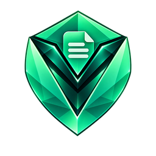
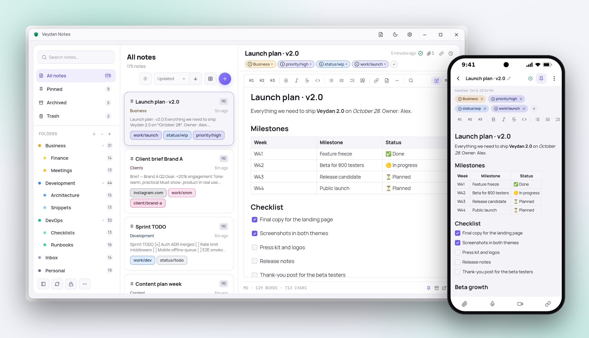
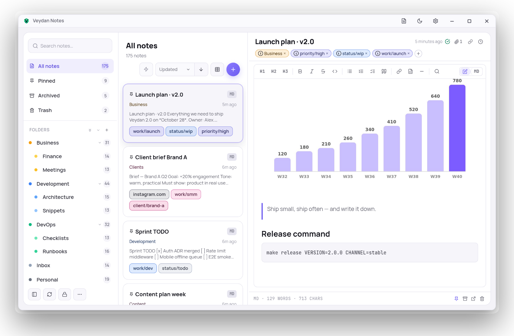
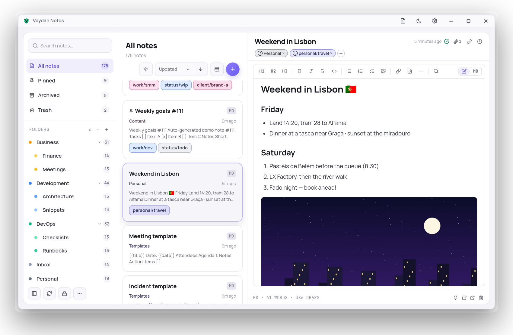
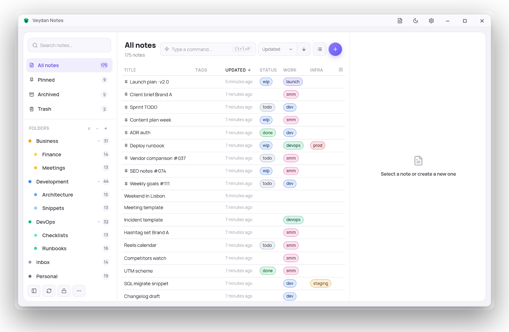
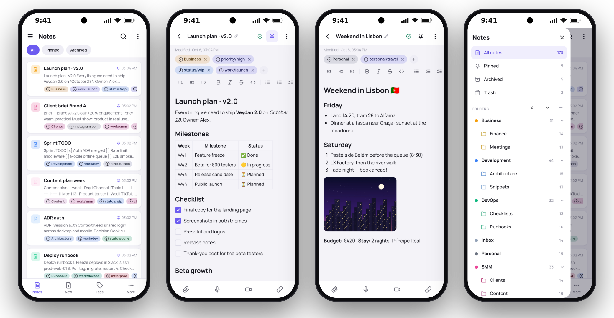

  

<h1 align="center">Veydan Notes</h1>

  <b>Notes with end-to-end encrypted sync.</b> 
  Markdown notes that live on your disk, sync through storage you own, and work on your computer and phone.

  
  
  

  <a href="https://github.com/veydanproject/Veydan-Notes/releases/latest"><b>Download</b></a> ·
  <a href="#features">Features</a> ·
  <a href="#on-your-phone">On your phone</a> ·
  <a href="#privacy">Privacy</a> ·
  <a href="docs/DEVELOPMENT.md">Build from source</a>

<picture>
  <source media="(prefers-color-scheme: dark)" srcset="docs/images/hero-dark.jpg">
  
</picture>

## Why Veydan Notes

- **Your notes are files.** Every note is a plain Markdown file in a folder
  you choose. Open it in any editor, back it up any way you like — nothing is
  locked inside the app.
- **Sync without giving your notes to anyone.** Sync goes through your own
  folder, S3 bucket or WebDAV share, and everything is encrypted on the
  device first. There is no Veydan cloud and no account.
- **Nothing gets lost.** Every save keeps the previous version: compare,
  restore or merge any of them.
- **Computer and phone.** Windows, macOS, Linux and Android, with the same
  notes everywhere.

## Features

### Write in Markdown, see it formatted

A rich editor with headings, **tables**, checklists, quotes, code blocks,
links and images — or switch to the raw Markdown source with one click.
Paste or drop a picture or a file and it becomes an attachment.

<picture>
  <source media="(prefers-color-scheme: dark)" srcset="docs/images/screen-note-image-dark.png">
  
</picture>

### Organise your way

- **Folders and subfolders**, **colored tags** (a tag like `status/todo`
  groups into "status"), **pins** and an **archive**.
- **Smart views** — saved filters: by tags, folder, open tasks, attachments,
  or what changed in the last days.
- **Wiki links** — type `[[` to link another note; every note shows what
  links to it.
- **Templates** — any note in the `Templates` folder becomes a template with
  `{{date}}`, `{{time}}` and `{{title}}` filled in.

<picture>
  <source media="(prefers-color-scheme: dark)" srcset="docs/images/screen-trip-dark.png">
  
</picture>

### A table of all your notes

Switch the list to a **table**: tags become columns (status, project, area…),
so a pile of notes turns into a tracker you can sort.

<picture>
  <source media="(prefers-color-scheme: dark)" srcset="docs/images/screen-table-dark.png">
  
</picture>

### Find anything, keep everything

- **Full-text search** across every note, and find & replace inside one.
- **Version history** — compare any two versions line by line, restore one,
  or merge pieces of an old version back in.
- **Safe sync conflicts** — if two devices change the same lines, nothing is
  thrown away: you choose per piece what to keep.
- **Crash-safe drafts** — unsaved text comes back after an unexpected close.
- **Edits from outside** — change a file in another editor and the app picks
  it up.

### Capture in a second

A **quick-capture window** from the tray or the command palette: type, pick a
folder or tags, or take the text from the clipboard, and save with
<kbd>Ctrl</kbd>+<kbd>Enter</kbd>. The **command palette** reaches every
action from the keyboard.

### Import and export

Import Markdown and text files or whole folders (front matter and images
come along). Export to a folder or a ZIP — Markdown with your attachments,
optionally **encrypted with a passphrase**.

## On your phone

The Android app has the same notes, folders, tags and editor, plus photo and
file attachments straight from the phone.

<picture>
  <source media="(prefers-color-scheme: dark)" srcset="docs/images/phones-dark.png">
  
</picture>

## Sync between your devices

Settings → Sync. Create a vault in an empty place you control, then join it
from your other devices with the same passphrase:

- **a folder** that Dropbox, Seafile, Syncthing or any cloud client mirrors
  (on a computer);
- **an S3-compatible bucket** (AWS S3, MinIO, Cloudflare R2…);
- **a WebDAV share** (Nextcloud and others).

Sync is in **beta**.

## Download

Get the latest version from the
**[releases page](https://github.com/veydanproject/Veydan-Notes/releases/latest)**.

| Platform | What to download |
|---|---|
| **Windows** 10 and 11 (x64) | the `.exe` installer (or the `.msi`) |
| **macOS** — Apple Silicon | the `.dmg` marked `aarch64` |
| **macOS** — Intel | the `.dmg` marked `x64` |
| **Linux** (x64) | `.AppImage`, or `.deb` / `.rpm` for your distribution |
| **Android** 8.0 and newer (64-bit ARM) | the `.apk` |

If macOS refuses to open the app on the first launch, right-click it and
choose **Open**.

The app updates itself when a new version comes out. Installed from a
`.deb` or `.rpm`? The app tells you about the new version, and you install it
from the releases page.

## Privacy

- **No account, no telemetry.** The app talks only to your own sync storage
  and to GitHub, to check for updates.
- **Sync storage only ever sees ciphertext** — notes and attachments are
  encrypted on the device (XChaCha20-Poly1305, with a key derived from your
  passphrase by Argon2id) before they leave it.
- **On the device, notes are plain Markdown files** — that is what keeps them
  yours and readable anywhere. Protect the disk with full-disk encryption.
- **App lock** — a PIN or password, with auto-lock; it locks the app window.

## The Veydan family

| | App | What it is |
|---|---|---|
|  | **Veydan Notes** | Markdown notes with end-to-end encrypted sync |
|  | [Veydan Pass](https://github.com/veydanproject/Veydan-Pass) | Passwords and one-time codes, encrypted and synced |
|  | [Veydan Chat](https://github.com/veydanproject/Veydan-Chat) | End-to-end encrypted chat on Nostr |
|  | [Veydan Space](https://github.com/veydanproject/Veydan-Space) | All of them in one workspace, plus browser profiles, proxies and SSH |

## Feedback

Found a bug or have an idea? [Open an issue](https://github.com/veydanproject/Veydan-Notes/issues).
Developers: see [docs/DEVELOPMENT.md](docs/DEVELOPMENT.md) for building from
source.

## License

Copyright © 2026 **Veydan Project**.

Developed by **Rookbeam Technologies LLC**, USA.

Veydan Notes is **source-available** software under the
[PolyForm Perimeter License 1.0.1](https://polyformproject.org/licenses/perimeter/1.0.1):
see [`LICENSE`](LICENSE), a summary in [`LICENSE-SUMMARY.md`](LICENSE-SUMMARY.md)
and the licences of what it is built from in
[`THIRD-PARTY-LICENSES.md`](THIRD-PARTY-LICENSES.md).
